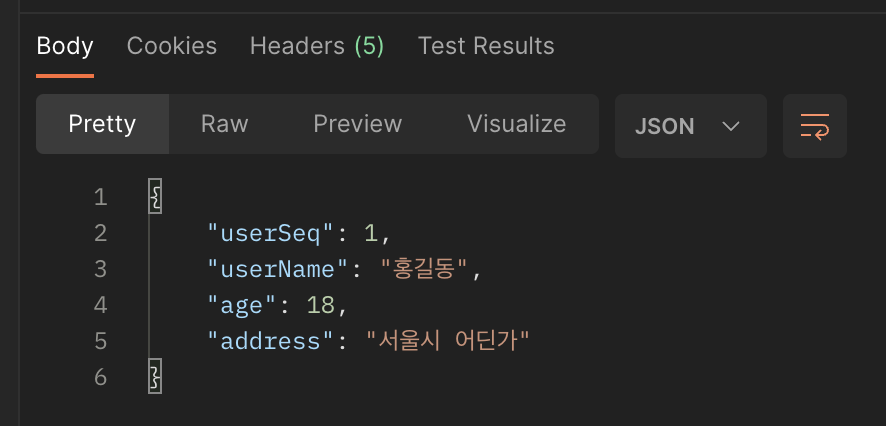

MapStruct를 이번 프로젝트에 사용하게 되었는데,
생각보다 지원하는 기능이 많고 생각해야 할 게 많아서 정리하면서 참고하면서 쓰려고 한다.
(피드백 받은 것도 까먹으면 안 되니까)

- 2020.05.13 실제 사용 코드 업데이트 완료!
- 2024.09.26 옮겨 쓰는 지금까지 다시 사용을 못 해봤다니

**TODO**
1. injectionStrategy = InjectionStrategy.FIELD
2. uses, @Named

---

# MapStruct

작업을 하다보면 엔티티와 DTO 간의 매핑할 일이 잦다.
매핑을 해줄 때마다 하나하나 매핑을 해줘야 하는 게 여간 번거로운 일이 아니다.

그래서 매핑을 자동으로 해준다는 MapStruct를 정리해본다.   
(modelMapper보다 속도 면에서 좋다고 한다.)

사용하고자 하는 Mapper 인터페이스를 생성하고 @Mapper() 어노테이션을 붙여준다.   
그리고 내부에 매핑을 원하는 메서드를 작성하고 이것저것 커스터마이징 하면,   
빌드 시에 해당 인터페이스를 implements 하는 클래스가 생성되어 해당 클래스를 사용하는 방식!


---
# build.gradle
Mapper가 getter, setter, builder로 매핑이 되고 있어서 lombok이랑 순서가 중요하다고 한다.

근데 그 상위 버전에서는 순서에 관계 없이 binding 하는 걸 넣어주면 문제가 없다고 하는데,   
나는 계속 문제가 생기고 실행이 되지 않았다.

그래서 어떤 분 것을 참고해서 아래와 같이 설정
```java
// lombok
implementation 'org.projectlombok:lombok:1.18.22'
annotationProcessor 'org.projectlombok:lombok:1.18.22'
annotationProcessor 'org.projectlombok:lombok-mapstruct-binding:0.2.0'

// mapstruct
implementation 'org.mapstruct:mapstruct:1.4.2.Final'
annotationProcessor 'org.mapstruct:mapstruct-processor:1.4.2.Final'
```
   
# @Mapper
### componentModel = "spring"
구현한 Mapper를 빈 등록하는 역할,   
다른 곳에서 의존성 주입 방식으로 주입해줘서 사용하려고 넣어준다.

아래와 같이 Mapper를 만들고
```java
@Mapper(
        componentModel = "spring",
        injectionStrategy = InjectionStrategy.FIELD
)
public interface UserMapper {

    GetUserResponse toResponse(User user);
}
```
실제 구현 단계에서
```java
@Service
@RequiredArgsConstructor
public class UserService {

    private final UserMapper userMapper;

    public GetUserResponse findUser(int userSeq) {

        // 생략

        return userMapper.toResponse(user);
    }
}
```
이렇게 주입해서 쓰는 것!

이 방식이 싫다면 static하게 사용하는 것도 가능해보인다.

   
### Mappers.getMapper(~~)
@Mapper 안에 componentModel 적어줬던 것을 지우고,   
Mappers.getMapper를 통해서 다른 곳에서 사용할 변수를 만들어준다.
```java
@Mapper()
public interface TestMapper {
	// 변수명은 달라도 되는 듯
	TestMapper INSTANCE = Mappers.getMapper(TestMapper.class);
    
    // 아래는 같음
}
```
이렇게 선언을 해주고,
의존성 주입 해준 것도 빼준다.
```java
public void test(TestRequest request) {
	Test test = TestMapper.INSTANCE.requestToTestEntity(request);
}
```
이렇게 사용해도 되더라고요?   
근데 매번 쓸 때마다 이렇게 적어줘야 할 텐데 불편하지 않을까?   
분명 장점이 있을 텐데 궁금하네요...

### unmappedTargetPolicy
이런 식으로 구현을 해두고 잘 돌아가길래 올렸는데 빌드 시에 경고가 떴다고 한다.   
그러면서 동시에 해결법도 알려주셔서 정리해서 써보려고 한다.

경고 문구는 아래처럼...
```
warning: Unmapped target properties: "testSeq, createdAt, createdBy, updatedAt, updatedBy".
    Test requestToTestEntity(request);
```
실제로 request 내부에서는 seq와 createdAt, createdBy, updatedAt, updatedBy를 갖고 있지 않다.

target이 매핑 되지 않았다?   
엔티티에는 있는데 dto에는 없어서 경고를 보내주는 듯 하다.

그런데 이런 경우가 굉장히 많을 텐데 이럴 때마다 경고가 뜨면 안 되니까 옵션을 달아준다.
```java
@Mapper(
	componentModel = "spring",
    unmappedTargetPolicy = ReportingPolicy.IGNORE
)
public interface TestMapper {
} 
```
ReportingPolicy에는 총 3가지의 값이 있다.

- IGNORE
- ERROR: 작성하고 빌드했더니 에러가 발생한다, 다음으로 넘어가질 못 함
- WARN: 아무것도 설정하지 않았을 때 얘가 떴으니 기본 값, 경고

---
# toDTO
실제로 사용해봅시다!

User 테이블에서 값을 조회해와서 바로 보여주면 안 되니까 GetUserResponse에 매핑해서 보여주고자 한다.
```java
@Entity
@Getter
public class User {

    @Id
    @GeneratedValue(strategy = GenerationType.AUTO)
    private int id;

    private String name;

    private int age;

    private String address;

}
```
```java
@Getter
public class GetUserResponse {

    private int userSeq;

    private String userName;

    private int age;

    private String address;

    @Builder
    public GetUserResponse(int userSeq, String userName, int age, String address) {
        this.userSeq = userSeq;
        this.userName = userName;
        this.age = age;
        this.address = address;
    }
}
```
여기서 포인트로 둘 점은,   
User에는 @Getter가 있고   
GetUserResponse에는 생성자가 @Builder로 되어있다는 것!

그리고 User에서는 id, name으로 되어있지만   
GetUserResponse에는 userSeq, userName으로 되어있다는 것이다.  
어떻게 매핑을 해줄까?   
```java
@Mappings({
            @Mapping(source = "id", target = "userSeq"),
            @Mapping(source = "name", target = "userName")
    })
    GetUserResponse toResponse(User user);
```
이렇게 해주면 된다.
정말 간단하죠?

매핑해줄 이름이 다르다면 @Mapping 어노테이션을 이용해서 매핑해주는 것!

실제 구현한 코드에서는
```java
@Override
    public GetUserResponse toResponse(User user) {
        if ( user == null ) {
            return null;
        }

        GetUserResponseBuilder getUserResponse = GetUserResponse.builder();

        getUserResponse.userSeq( user.getId() );
        getUserResponse.userName( user.getName() );
        getUserResponse.age( user.getAge() );
        getUserResponse.address( user.getAddress() );

        return getUserResponse.build();
    }
```
이렇게 나오고 있다.   
내가 GetUserResponse를 builder를 통해서 생성하도록 설정해주었기 때문이다.  
어디서 봤는데 @Builder가 있다면 이걸 가장 우선 순위로 두어 생성한다고 한다.   

실제 포스트맨에서 실행해줬을 때 아주.. 잘 매핑 된다.   



---
# update 할 때는...
작업을 하다보니 어떤 인스턴스의 값을 PUT 요청을 받아 수정할 때   
해당 값을 **조회한 다음에 전부 매핑해주면 되지 않나?** 라는 생각이 들었다.
```java
public void modifyUser(ModifyUserRequest request) {
        Optional<User> optionalUser = userRepository.findById(request.getUserSeq());

        if (optionalUser.isEmpty()) {
            throw new RuntimeException("회원이 없습니다.");
        }

        User user = optionalUser.get();

        // 여기서 매핑을 해주면 되지 않을까?
        // 영속성 컨텍스트로 관리하고 변경점 찾아서... 업데이트 해줄 테니까...
        
    }
```
그래서 업데이트 할 수 있는 방법이 있나... 찾아봤다.

그래서 찾아본 건데, 방법이 좋지 않다.
```java
@Mappings({
            @Mapping(source = "userSeq", target = "id"),
            @Mapping(source = "userName", target = "name"),
            @Mapping(source = "userAge", target = "age"),
            @Mapping(source = "userAddress", target = "address")
    })
    void updateUser(ModifyUserRequest request, @MappingTarget User user);
```
이렇게 @MappringTarget으로 해당 타겟에 값을 넣어주는 것인데
이게 생성이 아니라 해당 타겟에 값을 넣어주는 방식이다보니

엔티티에 setter가 필요하다...!!!!

그래서 이 방식은 아무래도 안 되는 것으로...😞